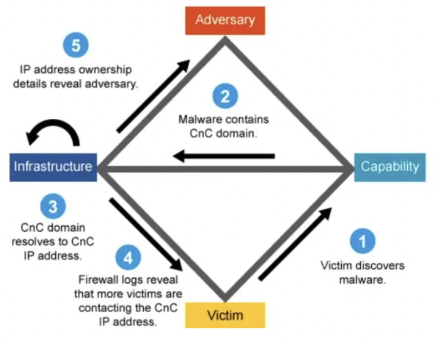

# Attack Frameworks

## Three Types of Attack Frameworks
- These models can be used individually or combined

## Kill Chain
- A model developed by Lockheed Martin that describes the stages by which a threat actor progresses through a network intrusion.
- A kill chain analysis can be used to identify a defensive course-of-action matrix to counter the progress of an attack at each stage.
- This is an older and very linear model

    - 1. Reconnaissance
        - The attacker determines what methods to use to complete the phases of the attack
        - Start with passive information gathering
        - Transition to active scanning
        - When reconnaissance is completed, you should have a good understanding of the network and any vulnerabilties that exist.

    - 2. Weaponization
        - Attacker combines payload code that will enable network access with exploit code that will use a vulnerability to execute on a target system
            - Creating the malware or exploit you want to run

    - 3. Delivery
        - Attacker identifies a vector by which to transmit the weaponized code to the target enviornmenet
            - Email
            - USB Thumb Drive

    - 4. Exploitation
        - Weaponized code is executed on the target system by mechanism identified in the delivery phase
            - Clicking a link in an email

    - 5. Installation
        - This mechanism enables weaponized code to run a remote access tool to achive persistence on the target system.

    - 6. Command and Control (C2)
        - Weaponized code establishes an outbound channel to a remote server that can then be used to control the remote access tool and potentially download additional tools to progress the attack.
        - You own the system and take action on it

    - 7. Actions on Objectives
        - The attacker typically uses the access they has achieved to covertly collect information from the target system and transfer it to a remote system (data exfiltration)

## MITRE ATT&CK Framework
- A knowledge base maintained by the MITRE corporation for listing and explaining specific adversary tactics, techniques, and common knowledge or procedures
- https://attack.mitre.org/
- Uses a matrice mode
- Very focused on expolitation phase
- ### pre-ATT&CK matrix
    - Aligns to the reconnaissance and weaponization phases of the kill chain

## Diamond Model of Intrusion Analysis
- A framework for analyzing cybersecurity incidents and intrusions by exploring the relationships between the four core features:
    - Advesary
    - Capaility
    - Infrastructure
    - Victim

- Represents an intrusion event
- Support meta-features
    - Timestamp
    - Phase
    - Result
    - Direction
    - Methodology
    - Resources

